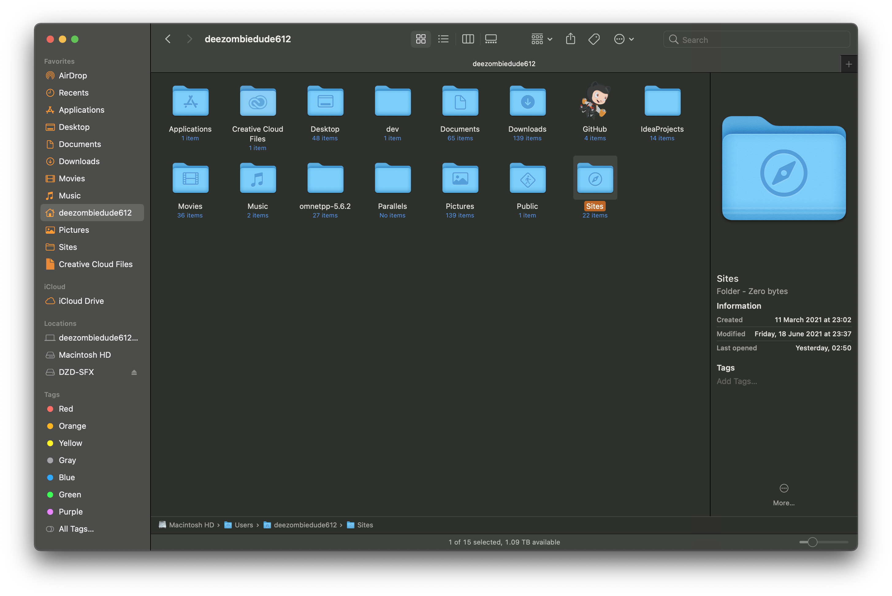

# 2 Apache 🦅

## Installation

Stop and unload the mac system build in apache

```
sudo apachectl stop
sudo launchctl unload -w /Systems/Library/LaunchDaemons/org.apache.httpd.plist

```

Install the [httpd formula](https://formulae.brew.sh/formula/httpd) with Homebrew (V2.4.37) (*httpd* is the same as *Apache2*)

```
brew install httpd
```

Start background service and start Apache

```
brew services start httpd
sudo apachectl start
```

Open your web browser and type [http://localhost:8080](http://localhost:8080) or [http://127.0.0.1:8080](http://127.0.0.1:8080) in the address bar. If the Apache Server has successfully started, you should see this appear in your web browser:


## Create Sites Directory

The page you're looking at now is a result of a default webpage file that is in the following location:

```
/usr/local/var/www
```

We will create a Sites directory under your home folder and use that folder to contain all our PHP web files. At the end of this guide, typing in [http://localhost](http://localhost) or [http://127.0.0.1](http://127.0.0.1) in your web browser's address bar will source the web files from this folder for view.

Head over to your account folder. Create a folder named Sites. Upon creating the folder, the folder icon should now have a compass image appear on top of it like as shown below:




## Configuration

Open in your favourite editor the file `/usr/local/etc/httpd/httpd.conf`
Find and replace configs:

\# | Change
------ | ----
**From** | `Listen 8080`
**To** | `Listen 80`
**From** | `DocumentRoot "/usr/local/var/www"`
**To** | `DocumentRoot "/Users/YOUR_USERNAME/Sites"`
**From** | `<Directory "/usr/local/var/www">`
**To** | `<Directory "/Users/YOUR_USERNAME/Sites">`
**From** |`AllowOverride None` *
**To** | `AllowOverride All `
**From** | `#LoadModule rewrite_module lib/httpd/modules/mod_rewrite.so`
**To** | `LoadModule rewrite_module lib/httpd/modules/mod_rewrite.so `
**From** | `User _www `
**To** | `User YOUR_USERNAME `
**From** | `Group _www `
**To** | `Group staff `
**From** | `#ServerName www.example.com:8080`
**To** | `ServerName localhost:80`

\* Inside the previously edited `“<Directory “/Users/YOUR_USERNAME/Sites”>”`

Yeehaw! Apache is now installed and configured. After saving your changes in the httpd.conf file you need to restart your apache server with `sudo apachectl restart`. After that you can open [http://localhost](http://localhost) and should see the documents from your Sites directory.

What’s next? In my next tutorial “[Create vHosts for multiple local URLs with Homebrew Apache2/httpd](https://medium.com/@JanFaessler/create-vhosts-for-multiple-local-urls-with-homebrew-apache2-httpd-97d4ec59e125)” you can learn more about how to create multiple local URLs with different document roots.

--


